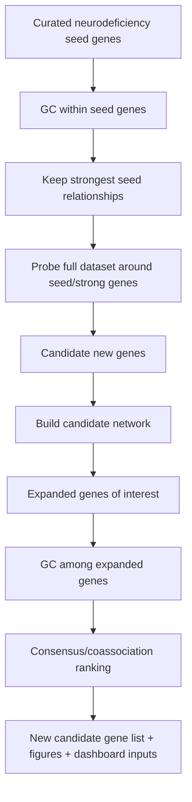

# Neurodeficiency Gene-Expansion Pipeline

The central idea of this project is guided discovery.

Instead of starting with brute-force Granger causality across every gene in the dataset, the pipeline starts from a curated set of genes already implicated in a neurodeficiency context. Those genes provide biological prior knowledge. The pipeline first asks which relationships are strong inside that trusted seed set, then uses those strong relationships to probe the full dataset for possible new genes of interest.

## Conceptual Flow

## Dialed-In Pipeline Steps

1. Start with `x` curated neurodeficiency-implicated seed genes.
2. Run `x * (x - 1)` directed Granger causality calculations among seed genes, excluding self-pairs.
3. Treat significant GC results as directed network edges using the configured p-value threshold.
4. Run Louvain community detection many times around the gene of interest, increasing the number of runs until the coassociation frequencies are stable.
5. Write a seed consensus CSV with each network gene and its frequency of being in the same community as the gene of interest.
6. Select probe genes from that frequency CSV using either top percent or a minimum frequency cutoff. The gene of interest is always included.
7. Probe the full dataset in both directions: selected genes to all dataset genes and all dataset genes to selected genes, excluding duplicate ordered pairs and self-pairs.
8. Build a significant-edge network from the probe results and write all genes in that network as the expanded candidate set `y`.
9. Run `y * (y - 1)` directed GC among the expanded candidate genes.
10. Run the same stability-controlled Louvain consensus on the expanded GC network.
11. Use the final sorted `Gene, Coassociation Frequency` table as the biological priority list for follow-up.

This strategy makes the search space smaller and more biologically meaningful at the start, while still allowing the dataset to suggest new candidate genes.

The canonical runner is `python3 scripts/pipeline/run_pipeline.py --config configs/gene_expansion.example.yml`. It can also resume from any stage when the required upstream artifact is provided.
